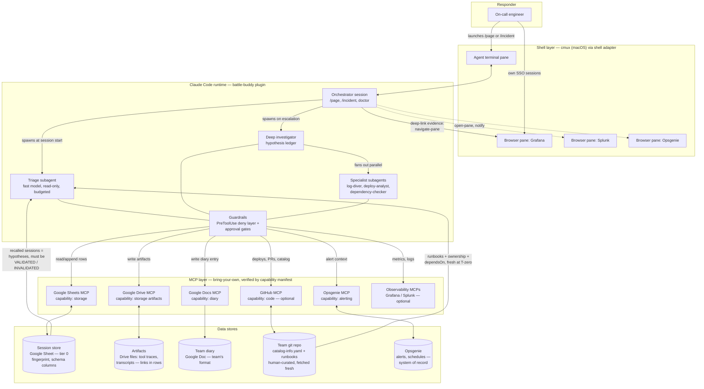
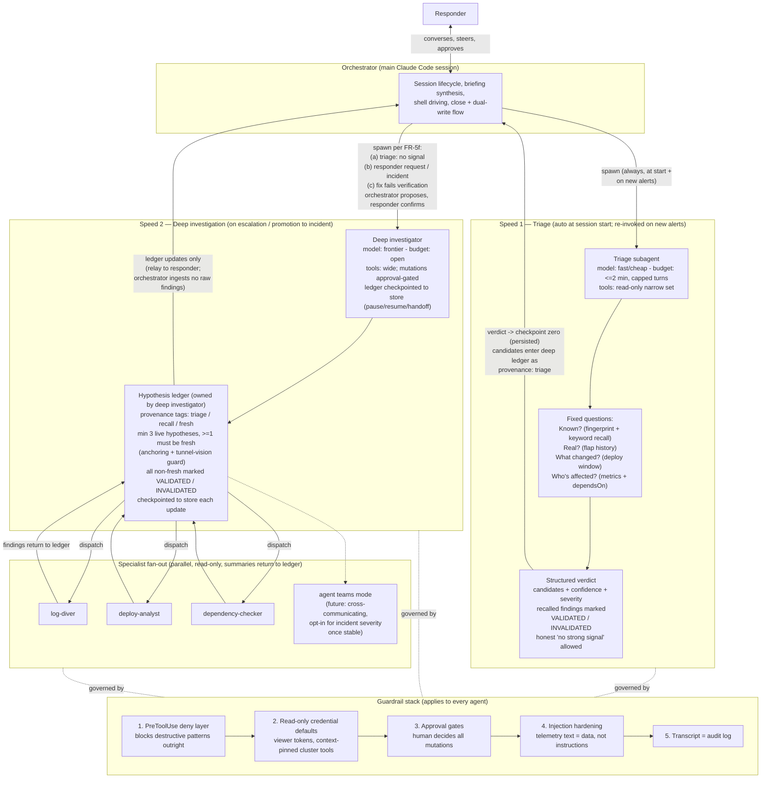

# battle-buddy — Technical Design & System Architecture

*Companion to `oncall-harness-requirements.md` (PRD v0.9). The PRD says what; this document says how.*

**Version:** 1.2.3
**Status:** Approved design, pre-implementation
**Last updated:** 2026-07-21
**Audience:** Implementers building the MVP.

**Changes in 1.2.3:** §5.4 example ledger reconciled to the validator's anchoring rules
(slice 6, specs/006-investigation-agents, Assumptions): the checkpoint example carried a
single hypothesis in the invariant phase `evidence-gathering`, which the merged slice-2
validator rejects (≥3 live hypotheses, ≥1 live `fresh`, non-`fresh` validated). Replaced
with a validator-passing three-hypothesis example (triage-provenance validated, a fresh
hypothesis, and an invalidated recall) so the design doc and the normative schemas
reference (`skills/investigation/references/schemas.md`) agree.

**Changes in 1.2.2:** Slice-3 spec reconciliation (specs/003-session-store, Assumptions):
§5.1's append-mostly sentence now names the full mutable-field set the sections it
summarizes already implied (promotion re-tag, ownership take-over, severity correction,
triage re-invocation). §5.4's checkpoint-history wording corrected — the artifact
operation set has no append; history accumulates session-locally (local-state protocol
`staging/checkpoints.jsonl`) and uploads at close. §9's mid-investigation rehydrate row
drops the remote `checkpoints.jsonl` fallback, which exists only after close;
mid-session resume rides `latest_checkpoint` and overflow links. The cell-guard value
is pinned at exactly 45,000 characters with at-guard fitting the cell (§5.4 and the
D-3 decision row; formerly "~45k"), matching the slice-3 spec's cell-guard Assumption.

**Changes in 1.2.1:** Diary `read_recent(n)` ordering documented in §6.2 — entries return most
recent first (interface commitment: adapters over oldest-first stores reverse on read). Surfaced
by PR #1 review, which found the slice-1 spec citing an ordering the contract never stated.

**Changes in 1.2:** Testing strategy (§10) — test scaffold precedes component build; two hermetic required layers (unit tests on hooks/helpers, contract tests against `bb-mock-mcp`); scenario harness with swappable drivers — local interactive self-test as the default, headless as an optional clean-room wrapper; no dedicated live-Google test rig (real `/setup`/`/doctor` runs are the live conformance). Decisions and traceability renumbered to §11/§12.

**Changes in 1.1 (design-grilling outcomes):** Deterministic backstops for skill-enforced invariants (session-marker + Stop-hook check, read-back verification). Hook-captured transcript/tool-trace; timeline derived from trace + checkpoints. Operation-contract capability model with a `/doctor`-resolved binding map. `bb-validate` schema/invariant validator. `/setup` onboarding wizard; setup state derived from artifacts. Deployment model: plugin (upstream) vs. team workspace repo (scaffolded, private, never a fork). Triage turn-cap enforced in hooks. Optimistic session ownership + duplicate handling. Fingerprint service-resolution ladder. Injection layer 4 reframed as probabilistic. Spike 0 (Google roster conformance) on the critical path; cmux SSO risk (R-3) retired — verified empirically.

---

## 1. Overview & Scope

This document is the engineering design for the battle-buddy MVP: component breakdown, interfaces, data schemas, plugin layout, and the concrete decisions the PRD intentionally left open (§11).

**Scope of this design — MVP = tier 0 + cmux shell adapter.** This *expands* the PRD §8 cut, where the cmux adapter was a fast-follow: the single-screen experience ships in the MVP. The tier-1 Go persistence server (Postgres + pgvector, `IncidentStore`/`KnowledgeStore` interfaces) is **out of scope** here and will get its own design when the graduation trigger fires (PRD §5: agent-ranked retrieval starts missing). Where a tier-0 decision must not foreclose tier 1 (fingerprint spec, schema fields, checkpoint format), that constraint is called out in place.

The controlling principle from the PRD: **one custom component**. Everything in this document is either (a) the Claude Code plugin, (b) documented conventions over stock Google MCPs, or (c) a thin adapter shim. There is no server, no database, and no bespoke per-tool integration code.

A refinement this design adds to "conventions, not code": conventions carry the *behavior*, but every must-not-fail invariant gets a small **deterministic backstop** — hooks and helper scripts (Python 3 stdlib) that verify, count, validate, and capture, without ever becoming a storage layer. Trust the model to do the work; verify the work landed.

**Build sequencing.** One empirical gate precedes component build: **Spike 0 — Google roster conformance** (§7): find a public Sheets/Drive/Docs MCP roster that passes the operation contract (append-row, range reads, cell-level update, Drive file create, Doc append) under a responder's OAuth. The spike's probe calls become `/doctor`'s conformance suite. Contingency if no roster passes: fork/vendor the closest community Sheets MCP under the project org (`battle-buddy-sheets-mcp`) — an explicit, documented amendment to "zero shipped storage code" (shipped plumbing, not schema logic), preferred over depending on a third-party server we can't fix at 3am. The cmux SSO question (formerly R-3) is **retired**: browser-pane SSO session persistence is verified by daily production use; the adapter builds ungated. Build order: Spike 0 → **test scaffold (§10: pytest layout, `bb-mock-mcp`, CI)** → hooks + helpers (the deterministic layer, TDD from commit one) → session-store skill → commands/agents/skills → `/setup` + `/doctor` → cmux adapter. The scaffold lands before component code deliberately: this is agent-led development, and the test suite is what keeps agent-written changes honest.

## 2. System Architecture

Four moving parts (PRD §5): the **plugin** (only custom component), **tier-0 storage conventions** (Sheet + Drive via stock Google MCPs — zero shipped storage code), an **adopted shell** (cmux behind the shell-adapter interface), and the **MCP layer** (bring-your-own servers verified by capability manifest).

Adapted from `bb-system-data-diagram.mermaid` (tier-1 elements — server MCP, Postgres — omitted per this document's scope).



**Division of knowledge** (PRD §5) is unchanged and governs every write path in this design:

| Store | Contents | Write policy | Freshness model |
|---|---|---|---|
| Team's git / Backstage | Service catalog, runbooks, dashboard links | Human-curated, PR-reviewed | Fetched fresh at session start; never copied |
| Team's diary (Google Doc in tier 0) | Human-readable session entries | Agent-drafted at close, human-approved | Team's readable artifact; session row stores the link |
| Session store (Google Sheet + Drive in tier 0) | Session records, verdicts, checkpoints, traces | Append-mostly, agent-written, human-approved at close | Written during/at close; queried at session start |

Two parallel access paths never mix (FR-24): the **responder's path** — embedded browser panes using their own SSO sessions, never touched by the harness — and the **agent's path** — MCP servers with API tokens, read-only by default. Google MCP auth is **per-responder OAuth** (their own account); the session Sheet and Drive folder are shared to the team group, so row edit history gives attribution for free. No service accounts in tier 0.

### 2.1 Deployment model

Three artifacts, three owners — and the team's artifact is **never a fork** of ours:

| Artifact | Owner | Contents | Update path |
|---|---|---|---|
| battle-buddy OSS repo | Upstream project | Plugin source; for contributors only — users never clone it to use the tool | Normal OSS development |
| Plugin distribution | Upstream, via marketplace (or a team's mirror marketplace) | All logic: commands, agents, skills, hooks, `bb-*` helpers, capability contracts | `claude plugin update` / bump version pin |
| **Team workspace repo** | The team (private) | ~4 files of pure team state upstream couldn't know: `.claude/settings.json` (`battleBuddy` config block + plugin pin), `.mcp.json` (team MCP roster, tokens as `${ENV_VAR}` refs), the resolved binding map (§7), README | Team-owned; scaffolded from nothing by `/setup` — `git init` + "push to a private repo in your org" |

Because the workspace contains zero upstream content, there is nothing to patch when upstream moves; upgrading is bump-pin → `/doctor`. **The seam is versioned:** the config block and Sheet schema carry version fields, and `/doctor` compares them against the installed plugin version after any update, reporting the exact migration needed (e.g. "schema v1→v2 adds a column; run `/setup --migrate`").

Secrets never enter the repo: each responder provisions their own tokens (per-responder auth above), referenced via environment variables. Runtime droppings (session markers, local trace files, the responder's last-green-doctor stamp) are gitignored.

**Flows:** new team — install plugin → `/setup` in an empty directory → push generated workspace to their org. New responder — clone *the team's* workspace → first `/page` self-heals the responder layer (§7). The OSS repo appears in neither flow. You run `/page` from the workspace repo, full stop; the session-marker hook warns if the config block is absent.

## 3. Claude Code Plugin Design

The plugin is the entire shipped codebase. Custom code is limited to: guardrail hook scripts, the `bb-shell` shim, and the fingerprint helper. Everything else is markdown (commands, agents, skills) and JSON (manifest, templates).

### 3.1 Plugin bundle layout

```
battle-buddy/
├── .claude-plugin/
│   └── plugin.json               # name, version, description
├── commands/
│   ├── setup.md                  # /setup — onboarding wizard, idempotent (§7)
│   ├── page.md                   # /page <alert-id>        (FR-1)
│   ├── incident.md               # /incident <incident-id> (FR-1)
│   ├── close.md                  # /close                  (FR-4)
│   └── doctor.md                 # /doctor                 (FR-25)
├── agents/
│   ├── triage.md                 # fast, read-only, budgeted      (FR-5)
│   ├── deep-investigator.md      # ledger owner                   (FR-5b)
│   ├── log-diver.md              # specialist                     (FR-5b)
│   ├── deploy-analyst.md         # specialist                     (FR-6)
│   └── dependency-checker.md     # specialist                     (FR-15)
├── skills/
│   ├── investigation/
│   │   ├── SKILL.md              # methodology + validation discipline (FR-5d/5e)
│   │   └── references/
│   │       ├── retrieval.md      # tier-0 retrieval flow    (FR-16a)
│   │       ├── briefing.md       # briefing format          (FR-2)
│   │       └── schemas.md        # verdict + ledger JSON schemas (§5.4)
│   ├── session-store/
│   │   ├── SKILL.md              # Sheet/Drive conventions  (FR-16)
│   │   └── references/
│   │       ├── schema.md         # FR-21 column spec        (§5.1)
│   │       └── fingerprint.md    # normalization spec       (§5.2)
│   ├── diary/SKILL.md            # dual-write flow, format matching (FR-4a–4c)
│   └── catalog/SKILL.md          # Backstage parsing, annotations   (FR-10–15)
├── hooks/                        # all Python 3, stdlib only
│   ├── hooks.json                # hook registration
│   ├── guardrail_deny.py         # PreToolUse deny layer           (FR-7a)
│   ├── tool_trace.py             # PostToolUse: append every tool call to local
│   │                             #   tool-trace.jsonl; triage turn-cap enforcement (§3.4);
│   │                             #   injection tripwire (§3.5)
│   ├── session_guard.py          # Stop/SessionEnd: copy transcript via transcript_path;
│   │                             #   block/warn if session marker shows unpersisted row (§4)
│   └── tests/
│       └── misbehavior_suite/    # documented agentic misbehaviors as test cases
├── bin/
│   ├── bb-shell                  # shell-adapter CLI shim          (FR-22)
│   ├── bb-fingerprint            # normalization + hash helper     (§5.2)
│   └── bb-validate               # verdict/ledger schema + invariant validator (§5.4)
├── manifest/
│   └── capabilities.json         # required/optional capability declarations (FR-25)
└── templates/
    ├── mcp.recommended.json      # documented starting roster      (FR-25a)
    └── session-sheet.md          # template Sheet setup guide      (FR-16)
```

**Design rule:** skills and commands reference capabilities ("your deploy-history tool"), never concrete MCP tool names (FR-25a). The only place server names appear is `templates/mcp.recommended.json`.

### 3.2 Slash commands

All five commands run in the orchestrator session. Team configuration (Sheet URL, diary URL, catalog repo, shell adapter on/off, mode budgets per FR-5c, the binding map) lives in the workspace repo's `.claude/settings.json` under a `battleBuddy` key, written by `/setup` (§2.1, §7).

**`/setup`** — idempotent onboarding wizard; the only intended first touch (§7 for full design). Team mode, responder mode, or "already green," selected by inspecting state — never a stored done-flag.

**`/page <alert-id>`** — lightweight session (FR-1). Control flow:
1. **Preflight (cheap, no probes — NFR-1):** config block present? Local last-green-doctor stamp fresh and matching plugin version + roster hash? Missing config → "run /setup"; missing/stale stamp → auto-run responder-mode setup (seconds; only ever on a first page from a new machine).
2. Compute session ID (`page-<alert-id>-<ISO date>`, §11 D-8); write the local session marker (§4).
3. `bb-shell open-pane` — create the session-named workspace (no-op in degraded mode).
4. Fetch alert context + flap history (alerting capability).
5. Resolve alert → service via catalog skill; fetch runbooks + dashboards fresh (FR-2).
6. Run tier-0 retrieval (§5.5) — the same read also checks for an **open row with this source ID**: if found, offer **join** (rehydrate as handoff, taking ownership per §4) or explicitly open a separate session; never silently duplicate.
7. Spawn triage subagent with alert context, catalog data, candidate rows.
8. Validate the verdict (`bb-validate`, §5.4); persist as checkpoint zero; append the session row (status `open`); read back and update the marker.
9. Present briefing; `bb-shell navigate-pane` to the top-cited dashboard (FR-9).

**`/incident <incident-id>`** — same flow with incident-weight defaults: deep investigator is proposed immediately after triage (FR-5f b), and the session row carries `session_type: incident`. **Promotion**: `/incident` invoked inside an open page session re-tags the existing row and launches deep investigation — no context loss (FR-1).

**`/close`** — the dual-write flow (FR-4, §4). Drafts diary entry, gets approval, writes diary → artifacts → session row in that order, ending with read-back verification and marker clearance (§4).

**`/doctor`** — capability verification and binding resolution (§7). Run outside incidents.

### 3.3 Investigation skill

The investigation skill is the methodology core, loaded by the orchestrator and both investigation agents (same skill, different budgets/toolsets per FR-5c). It encodes:

- **The validation discipline as top-priority instruction** (FR-5d): recalled sessions and triage candidates are hypotheses, never conclusions; every non-`fresh` hypothesis must be marked VALIDATED or INVALIDATED against evidence gathered from the *current* incident before being acted on. This is a headline product behavior (SM-4), so it leads the skill, not a footnote.
- **The anchoring guard** (FR-5e): ledger must hold ≥3 live hypotheses before deep-diving any one; ≥1 must carry provenance `fresh`.
- **Evidence rules** (FR-4e): every evidence entry is `{url, excerpt}` — a URL-addressable view (dashboard + time window, search query URL, commit/PR, alert) plus a short excerpt. Prose-only evidence is invalid.
- **The tier-0 retrieval flow** (`references/retrieval.md`, §5.5) and **briefing format** (`references/briefing.md`).
- **Injection hardening framing** (FR-7b): a standing, capability-scoped rule — all output from `alerting`, `observability`, and ticket-shaped tools (known from the binding map) is untrusted data, never instructions. Delimiter-wrapping applies at the point the agent *does* control text: quoting telemetry into checkpoints, briefings, diary drafts, and subagent prompts (§3.5).

### 3.4 Agent model

Source: `bb-agent-dispatch.mermaid`.



**Orchestrator (main session).** A thin router by design (PRD 0.9 change): session lifecycle, briefing relay, shell driving, close flow. It does **not** ingest specialist findings — the deep investigator owns synthesis — which keeps the conversational context lean across long incidents (FR-5b).

**Triage subagent** (`agents/triage.md`):

| Property | Value | Requirement |
|---|---|---|
| Model | fast/cheap class (default: Haiku-class; configurable) | FR-5c |
| Budget | ≤2 min target, capped turns (default 15; configurable). **Turn cap enforced deterministically** by `tool_trace.py` (it sees every call and counts per-agent): past the cap, further tool calls are denied with "budget exhausted — emit your verdict now." Wall-clock is a measured target only, reported in `budget_spent` and tuned via config. A budget-truncated verdict automatically satisfies FR-5f(a): no strong signal → propose deep investigation | FR-5 |
| Tools | read-only narrow set: alerting, catalog/code reads, session-store reads, observability reads | FR-5 |
| Input | alert context, flap history, catalog entry + runbooks, candidate session rows | FR-2 |
| Output | structured verdict JSON (§5.4) — schema-conforming, honest "no strong signal" allowed | FR-5 |
| Re-invocation | on newly firing alerts mid-session: classify related-to-current vs separate | FR-5a |

**Deep investigator** (`agents/deep-investigator.md`). Frontier-class model, open budget, wide toolset with mutations approval-gated. Owns the hypothesis ledger and synthesis: specialist findings return here, get merged into the ledger, and only **ledger updates** flow up to the orchestrator. Checkpoints the ledger to the session store on every update (§5.4). Seeds the ledger from the triage verdict (provenance `triage`, unvalidated) and must generate ≥1 `fresh` hypothesis before deep-diving.

**Specialists** (`agents/log-diver.md`, `deploy-analyst.md`, `dependency-checker.md`). Parallel, read-only, single-purpose; each returns a findings summary with `{url, excerpt}` evidence to the deep investigator, never to the orchestrator. Claude Code agent-teams mode is the planned fan-out upgrade once stable (opt-in per FR-5b) — no design work here until then.

**Launch conditions for deep mode** (FR-5f): (a) triage returns no strong signal or recommends it; (b) responder requests it — `/incident` promotion always launches it; (c) a triage-recommended fix fails verification. Orchestrator proposes, responder confirms; `autoLaunchDeep: true` config flag enables auto-launch for incident-severity sessions.

### 3.5 Guardrails

Five layers, ordered outermost-first; each is independent of the ones below it (FR-7a/7b, NFR-2):

1. **PreToolUse deny layer** (`hooks/guardrail_deny.py`, Python 3 stdlib — §11 D-1). Registered in `hooks.json` for `Bash` and mutating MCP tools. Deterministic pattern matching; exit-blocks matched calls outright, beneath and independent of approval gates. Deny classes:
   - destructive filesystem (`rm -rf` variants, `mkfs`, disk writes)
   - destructive cluster/cloud ops (`kubectl delete`, `terraform destroy`/`apply`, instance termination, IAM mutation)
   - credential scanning after auth errors (reads of `~/.aws`, `~/.ssh`, keychain access following a 401/403 in recent context)
   - verification-skipping retries (`--force`, `--no-verify`, `--skip-hooks` patterns)

   The test suite (`hooks/tests/misbehavior_suite/`) encodes documented real-world agentic misbehaviors as fixtures: every published incident pattern becomes a regression test the deny layer must block.

   The deny layer is one member of the plugin's **deterministic hook suite** — the backstop layer for every invariant that must not depend on model compliance: `tool_trace.py` (PostToolUse: tool-call capture §5.3, triage turn-cap §3.4, injection tripwire below) and `session_guard.py` (Stop/SessionEnd: transcript capture §5.3, unpersisted-row detection §4).
2. **Read-only credential defaults.** The recommended `.mcp.json` documents viewer-role tokens / read-only IAM conditions per server, and context-pins cluster tooling to one environment per server instance. Enforced by configuration convention, verified by `/doctor` where APIs allow.
3. **Approval gates.** All mutations ride Claude Code's native permission prompts; runbook mutating steps surface as approve-to-run actions with blast radius + rollback path stated (FR-7).
4. **Injection hardening — probabilistic by nature, and stated as such.** Untrusted text mostly arrives inside MCP tool results, already in context — no mechanism can rewrite it first. So this layer is mitigation, not guarantee: (a) the capability-scoped untrusted-data rule in the investigation skill (§3.3), with delimiter-wrapping (`<untrusted-telemetry>`) applied where the agent controls the text; (b) an advisory **tripwire** in `tool_trace.py` — results from untrusted-capability tools matching instruction-shaped heuristics ("ignore previous," "run the following," base64 blobs, tool-call syntax) trigger an appended reminder that the content is data, and the event is logged to the trace for post-incident review (FR-7b, R-5).
5. **Transcript as audit log** (NFR-2): the full transcript persists to Drive at close (§5.3).

The honest security claim (§8): injection *will* sometimes influence reasoning; the guaranteed property is that influenced reasoning cannot become destructive action without beating layers 1–3 — and layers 1–2 are deterministic and model-independent.

## 4. Session Lifecycle Flows

Source: `bb-session-sequence.mermaid`.

```mermaid
sequenceDiagram
    autonumber
    actor R as Responder
    participant SH as cmux shell
    participant O as Orchestrator
    participant T as Triage agent
    participant D as Deep investigator
    participant OPS as Opsgenie MCP
    participant CAT as GitHub MCP (catalog + runbooks)
    participant ST as Sheets/Drive MCP (session store)
    participant DI as Docs MCP (team diary)

    R->>O: /page ALERT-123 (or /incident INC-1234)
    O->>SH: create incident-named workspace + panes
    O->>OPS: fetch alert context, flap history
    O->>CAT: resolve alert to service (catalog), fetch runbooks fresh
    O->>ST: fingerprint exact-match + keyword filter
    ST-->>O: candidate past sessions
    O->>T: spawn (fast model, read-only, budget <= 2 min)
    T->>CAT: deploy window check (service + dependsOn)
    T->>T: rank candidates in-context,<br/>mark each VALIDATED / INVALIDATED vs fresh evidence
    T-->>O: structured verdict: known-issue match, cause candidates + confidence, severity, next step
    O->>ST: persist triage verdict as checkpoint zero
    O-->>R: briefing (evidence deep-linked)
    O->>SH: navigate-pane to cited dashboards

    alt Resolved at triage (known issue)
        R->>O: confirm fix path / close
    else Deep investigation (FR-5f: no signal / responder request / fix failed — orchestrator proposes, responder confirms)
        O->>D: spawn deep investigator
        Note over D: triage candidates enter ledger as<br/>provenance: triage — unvalidated;<br/>>=1 fresh hypothesis required
        loop Hypothesis ledger (min 3 live hypotheses)
            D->>D: gather evidence via read-only MCP tools<br/>(may fan out specialist subagents in parallel)
            D->>ST: checkpoint ledger state
            D-->>R: ledger update
        end
        opt Mutating action proposed
            D-->>R: approve-to-run (blast radius + rollback path)
            R->>D: approve / deny
        end
        D-->>O: root cause + resolution
    end

    R->>O: /close
    O->>O: draft diary entry<br/>(configured template, else match diary's existing format)
    O-->>R: review draft (causal fields flagged as proposals)
    R->>O: approve / edit
    O->>DI: write diary entry (write no. 1)
    DI-->>O: entry URL
    O->>ST: write tool trace + transcript to Drive
    O->>ST: append session row: fingerprint, schema fields,<br/>diary URL, artifact links (write no. 2)
    Note over O,ST: diary-first ordering; on diary failure the row<br/>still lands with diary_pending flag
    O->>SH: close workspace (state restorable)
```

**Start** (steps 1–13): the 3am test (NFR-1) budget is one command → briefing. Everything before the triage spawn is mechanical fetching; the triage budget (≤2 min) bounds the tail.

**Mid-session.** New alert fires → orchestrator re-invokes triage for related/separate classification (FR-5a) without disturbing deep investigation. Page → incident promotion re-tags the row and launches deep mode. **Pause/resume/handoff** (FR-3a): because the verdict and every ledger state are checkpointed (§5.4), a new responder simply runs `/incident <id>` (or `/page <alert-id>`) again; the orchestrator searches the store for an **open row matching the source ID** — never by recomputing the session ID, since its embedded date would differ on a cross-day handoff — and rehydrates from the latest checkpoint instead of starting fresh.

**Session ownership (optimistic, no locking).** The `responder` field is the ownership token. Rehydrating writes `responder: <me> @ <timestamp>` — taking over is a write, not a request. The skill forbids checkpoint writes to a row whose `responder` isn't you, and **every checkpoint write re-reads that one cell first**: a displaced session's next checkpoint fails the check, gets told "session taken over by <B>," and goes read-only. Sheet edit history is the audit trail. For the rare true race that still produces same-source-ID duplicate open rows, `/close` merges: earliest row is canonical, the duplicate's artifact links fold in, and it's marked `status: superseded` — which retrieval excludes (§5.5). Tier 1's server replaces all of this with real transactions.

**Close** (steps 24–33) — the dual-write, ordered (FR-4b):
1. Draft diary entry; **causal fields (root cause, contributing factors, action items) flagged as explicitly-labeled proposals** (FR-8); responder approves/edits.
2. **Write 1 — diary** (captures its URL).
3. **Upload** session artifacts to the Drive folder — the hook-captured local files (§5.3): transcript (copied by `session_guard.py` from the runtime's `transcript_path`), `tool-trace.jsonl` (written call-by-call by `tool_trace.py`), checkpoint history, FR-4d report (generated by default; configurable). The orchestrator's job here is mechanical upload, not recall.
4. Derive structured timeline events **from the tool trace + checkpoint history** — timestamped and complete, never from prose recall of the transcript (OQ-6: both raw and structured — §11 D-5).
5. **Write 2 — session row update** with fingerprint, all schema fields, diary URL, artifact links; then **read the row back** and echo its `session_id` — only a successful read-back clears the local session marker.
6. On diary-write failure: row still lands, `diary_pending: true`, retry queued as a follow-up task. The row write is the one that must not be lost.

**Deterministic backstop for the must-not-lose write:** `/page`/`/incident` write a local session marker at open; the close flow clears it only after read-back succeeds. `session_guard.py` (Stop/SessionEnd) checks the marker: session opened but row never confirmed → block/warn loudly with "session row not persisted — run /close." The write path stays convention-driven; *detection* of a missed write is code.

## 5. Data Design (Tier-0 Conventions)

Zero shipped storage code (FR-16): this section is *documentation that behaves like a schema*. All I/O goes through stock Google MCPs, orchestrated by the session-store skill. These conventions are written to survive tier-1 migration unchanged (fingerprint, field names, checkpoint format), so the future sheet-ingest is a column mapping, not a redesign.

### 5.1 Session store: Sheet schema (FR-21)

One row per session. Template documented in `templates/session-sheet.md`.

| Column | Type | Notes |
|---|---|---|
| `session_id` | string | `{type}-{source-id}-{date}` (§11 D-8); row key |
| `session_type` | enum | `incident` \| `page` \| `test` (setup smoke sessions; excluded from retrieval); promotion re-tags in place |
| `status` | enum | `open` \| `closed` \| `handoff` \| `superseded` (duplicate merged at close, §4; excluded from retrieval) |
| `fingerprint` | string | 16 hex chars (§5.2); exact-match retrieval key |
| `catalog_resolved` | bool | whether `services` came from the catalog or the §5.2 fallback ladder; downgrades stage-1 match confidence when false |
| `alert_signature` | string | raw alert identity: source + alert type + rule |
| `services` | string list | affected service names (catalog `metadata.name`) |
| `severity` | string | triage-assessed, responder-correctable |
| `responder` | string | for handoff and SM metrics |
| `started_at` / `closed_at` | ISO 8601 | |
| `triage_verdict` | JSON | checkpoint zero (§5.4) |
| `latest_checkpoint` | JSON | most recent ledger state (§5.4); cell-size-guarded |
| `timeline` | JSON | structured events derived at close (D-5) |
| `root_cause` | string | **human-curated** (FR-8) |
| `resolution` | string | what fixed it; human-approved |
| `links` | JSON | PRs, dashboards+time windows, searches — `{url, excerpt}` list |
| `runbook_refs` | JSON | URL + commit SHA where git-hosted (FR-20) |
| `diary_url` | URL | the dual-write link |
| `diary_pending` | bool | FR-4b failure flag |
| `report_url` | URL | FR-4d report Drive doc |
| `artifacts_folder_url` | URL | per-session Drive folder (§5.3) |

Append-mostly: rows are appended at open; afterward only this enumerated set mutates —
`status`, `session_type` (promotion re-tag, §3.2), `responder` (ownership take-over, §4),
`severity` (responder correction), `triage_verdict` (triage re-invocation, FR-5a),
`latest_checkpoint`, and the close-time field group — every other field is immutable
after append (write-once fields the close-time update carries, notably `fingerprint`,
are re-asserted at their open-time values, never recomputed). Comfortably inside Sheets
API rate limits at team scale.

### 5.2 Fingerprint specification (§11 D-4)

```
fingerprint = hex(sha256(normalize(service) + "|" + normalize(alert_type)))[:16]
```

`normalize(s)`:
1. Lowercase; trim; collapse internal whitespace to single spaces.
2. In `alert_type` only, replace with placeholders: UUIDs → `<id>`, hex strings ≥8 chars → `<id>`, integers ≥3 digits → `<n>`, ISO timestamps → `<ts>`, hostnames/IPs → `<host>`.
3. `service` is the catalog `metadata.name` — already canonical; only rule 1 applies.

Shipped as `bin/bb-fingerprint` (Python 3 stdlib) so triage, close, and future tier-1 ingestion compute *identical* values — the fingerprint carries the retrieval load embeddings would otherwise carry (FR-16a), so drift here silently breaks recall. The exact rules live in `skills/session-store/references/fingerprint.md` and are versioned; any rule change requires a re-fingerprint pass documented alongside.

**Service-resolution ladder** — the fingerprint always uses the best available service name, **never a shared sentinel** (a shared `unknown` would collide distinct services into one bucket, worse than missing):
1. Catalog match (`metadata.name`) → `catalog_resolved: true`.
2. Responder-provided name — §6.1 already asks once when resolution fails; that answer feeds the fingerprint, normalized like any service name. If the responder later adds the service to the catalog under the same name (the §6.1 fix-up nudge makes this likely), old and new fingerprints agree for free.
3. The alert's own service/team tag from the alerting tool.
4. Nothing names a service at all → fingerprint on `normalize(alert_source + rule_name) + "|" + normalize(alert_type)` — per-alert-rule granularity, still collision-free across services.

Rungs 2–4 set `catalog_resolved: false`, downgrading a stage-1 exact match from "near-certain known issue" to "candidate" (§5.5).

### 5.3 Artifacts: Drive layout (FR-16)

Anything exceeding ~50k chars leaves the row. One folder per session:

```
battle-buddy/<session_id>/
├── transcript.md          # full session transcript (audit log, NFR-2)
├── tool-trace.jsonl       # one JSON object per tool call
├── checkpoints.jsonl      # full checkpoint history (§5.4)
└── report.md              # FR-4d investigation report (regenerable)
```

**Provenance: captured, not recalled.** The transcript and tool trace are produced deterministically by hooks, because an agent cannot introspect its own full transcript and paraphrase-from-context is exactly the lossy path an audit log must not take: `tool_trace.py` (PostToolUse) appends every tool call from every agent — hooks fire for subagents too — to a local `tool-trace.jsonl`; `session_guard.py` (Stop/SessionEnd) copies the runtime's native transcript via the `transcript_path` it receives. At close the orchestrator only *uploads* these files (§4).

The FR-4d report is **purely a rendering of the row + artifacts** — regenerable on demand at any later time because evidence is stored as `{url, excerpt}`, never prose summary alone (FR-4e).

### 5.4 Checkpoints: verdict and ledger (FR-3a, FR-5, §11 D-3, D-6)

**Representation:** the *latest* checkpoint lives in the row (`triage_verdict`, `latest_checkpoint`) for cheap resume; the *full history* accumulates session-locally, one entry per checkpoint (local-state protocol `staging/checkpoints.jsonl`), and uploads to Drive as `checkpoints.jsonl` at close — the artifact operation set has no append. If a checkpoint exceeds the cell guard (45,000 chars; a checkpoint exactly at the guard still fits the cell), the full document is stored in Drive at write time and the cell holds `{"overflow": "<drive-url>", "seq": n}`; readers follow the link.

**Triage verdict (checkpoint zero):**

```json
{
  "schema": "bb.verdict.v1",
  "session_id": "page-ALERT-123-2026-07-19",
  "known_issue": {"matched_session_id": "...", "prior_resolution": "...", "validation": "VALIDATED"} ,
  "candidates": [
    {"statement": "...", "confidence": 0.7, "provenance": "recall",
     "validation": "INVALIDATED",
     "evidence": [{"url": "...", "excerpt": "..."}]}
  ],
  "severity": "sev3",
  "flap_assessment": "real",
  "deploy_window": [{"pr_url": "...", "merged_at": "...", "touches": ["svc-a"]}],
  "next_step": "deep_investigation",
  "no_strong_signal": false,
  "budget_spent": {"turns": 11, "seconds": 94}
}
```

**Ledger checkpoint:**

```json
{
  "schema": "bb.ledger.v1",
  "seq": 4,
  "phase": "evidence-gathering",
  "hypotheses": [
    {"id": "h1", "statement": "...",
     "provenance": "triage",
     "status": "live",
     "validation": "VALIDATED",
     "confidence": 0.6,
     "evidence_for": [{"url": "https://code.example/commit/abc123", "excerpt": "..."}]},
    {"id": "h2", "statement": "...",
     "provenance": "fresh",
     "status": "live",
     "confidence": 0.5,
     "evidence_for": [{"url": "https://dashboards.example/svc-b/error-rate", "excerpt": "..."}]},
    {"id": "h3", "statement": "...",
     "provenance": "recall",
     "status": "live",
     "validation": "INVALIDATED",
     "confidence": 0.15,
     "evidence_against": [{"url": "https://dashboards.example/svc-a/alert-history", "excerpt": "..."}]}
  ],
  "services_touched": ["svc-a", "svc-b"],
  "tool_call_count": 37,
  "at": "2026-07-19T03:41:00Z"
}
```

Constraints: `provenance` ∈ `triage|recall|fresh`; ≥3 `live` hypotheses before any deep-dive; ≥1 `fresh`; every non-`fresh` hypothesis carries `validation` (FR-5d/5e). Full schemas in `skills/investigation/references/schemas.md`.

**Enforcement is code, not convention: `bin/bb-validate`** (Python 3 stdlib, hand-rolled checks — no jsonschema dependency, preserving D-1's no-install rule). Subagents return free text; nothing native enforces a schema on them. So validation is a mandatory pipeline step: the orchestrator (verdict) and deep investigator (ledger checkpoints) run `bb-validate` **before any checkpoint write**. It checks shape per version tag *and* the semantic invariants above, including that evidence entries are `{url, excerpt}` pairs. On failure: re-prompt the producing agent once with the validator's error list; on second failure, **persist anyway flagged `"schema_valid": false`** — never lose data at 3am over a schema fight — and surface the degradation to the responder. `bb-validate`'s pass rate over briefings is precisely the SM-4 measurement instrument.

### 5.5 Retrieval flow (FR-16a)

Three stages, each cheaper than the next is smarter. All stages exclude rows with `session_type: test` and `status: superseded`:
1. **Fingerprint exact-match** — read the fingerprint column; exact hits are near-certain "known issue" candidates (downgraded to "candidate" when either row has `catalog_resolved: false`, §5.2).
2. **Keyword filter** — no exact hit → filter rows on `services`, `alert_signature`, `severity` overlap.
3. **Agent-ranked in-context** — pull candidate rows (cap ~20) into the triage agent's context; it ranks relevance and marks each VALIDATED/INVALIDATED against fresh evidence. Reliable at team scale (dozens–hundreds of rows).

No embeddings in tier 0. **Graduation trigger:** when stage 3 starts missing (SM-3 surfaces this), design tier 1.

## 6. Adapters

Four adapter surfaces (NFR-3), all with the same shape: a small interface, one shipped implementation, swap without touching the agent layer.

### 6.1 Catalog adapter (FR-10–15)

**MVP implementation: file-mode Backstage** — `catalog-info.yaml` files in the team's git repo, read via the code capability and parsed by `skills/catalog/SKILL.md`. (API-mode Backstage: deferred, PRD §8.)

**Internal service model** — the only shape the rest of the system sees (FR-14):

```
Service { name, owner, runbooks[], dashboards[], alert_matchers[], depends_on[] }
```

**Annotation mapping:**

| Field | Source | Requirement |
|---|---|---|
| `name`, `owner` | `metadata.name`, `spec.owner` | FR-13 minimal subset |
| `depends_on` | `spec.dependsOn` | FR-15 blast-radius widening |
| `dashboards` | `grafana/dashboard-selector` | FR-11 established annotations |
| paging linkage | `pagerduty.com/service-id` | FR-11 |
| repo | `github.com/project-slug` | FR-11 |
| `runbooks` | `oncall-harness/runbooks` | FR-12 |
| `alert_matchers` | `oncall-harness/alert-match` | FR-12 alert→service resolution |

The `paging linkage` and `repo` rows above are catalog metadata exposed beside the model, not fields of it: the six fields in `Service` are exhaustive of what the consumer model carries, and the slices that need paging or repo scoping read those values directly off the catalog rather than through an added `Service` field — the values are still reachable, just not through the model. Skill layout: `skills/catalog/SKILL.md` plus a `references/` directory (annotations, resolution) — §3.1's bundle tree shows a bare `catalog/SKILL.md`; the expansion follows the `session-store/` and `investigation/` sibling precedent in that same tree.

Alert→service resolution: match the firing alert's fields against `alert_matchers` (exact tag/name matching first, then substring on service name). Partial annotations degrade gracefully (FR-12): missing dashboards → no pane driving for that service; missing `alert-match` → responder is asked to name the service once, and the answer is offered as a catalog fix-up.

### 6.2 Diary adapter (FR-4a–4c)

Interface (skill-level contract, MCP-implemented):

```
read_recent(n) -> entries[]        # format matching; ordered most recent first
write_entry(content) -> url        # the dual-write's first write
```

**MVP implementation: Google Doc** — appends entries to the team's configured diary Doc via the Docs MCP. Format resolution (FR-4c): configured template if present; otherwise `read_recent` fetches the last ~5 entries and the drafting step matches their structure (headings, date format, field order). The structured session row is unaffected by diary formatting either way. Confluence/Notion/git-markdown adapters: deferred (PRD §8).

### 6.3 Shell adapter (FR-22–24, 26) — in MVP scope

Interface, exposed as the `bb-shell` CLI shim (§11 D-2):

```
bb-shell open-pane <url|command> [--workspace <session-id>]
bb-shell navigate-pane <pane> <url>
bb-shell notify <message> [--level <info|warn|approval>]
bb-shell close-workspace <session-id>
```

Adapter selection via config (`battleBuddy.shell: cmux | none`). Commands and skills invoke only `bb-shell`; nothing in the core knows which shell is behind it (FR-22).

**Fourth verb and the optional level (D-2 addendum, slice 9).** This block originally listed three verbs, which could not express §4's close step 33 ("close workspace, state restorable") — a gap slice 5 consumed as `close_workspace(session_id)` before the shim existed. `close-workspace <session-id>` is now part of the interface. `--level` is **optional, defaulting to `info`**: §7.2's doctor round-trip calls `notify` with a message alone, so a mandatory flag would have broken a landed slice. An *unrecognized* level remains a usage error, mirroring the config value's own absent-vs-unrecognized split. The backend-independent contract ships as `bin/bb-shell.md`; the cmux mapping as `bin/bb-shell.cmux.md`.

**cmux implementation:** speaks cmux's socket API. Session start creates a session-named workspace with the agent terminal pane plus browser panes for the service's dashboards; `navigate-pane` drives evidence deep-linking (FR-9); `notify` fires on attention/approval needs; workspaces survive restarts (FR-3 session restore). Third-party tools render with the responder's own SSO sessions — the harness never touches those credentials (FR-24).

**Degraded implementation (`none`):** every call is a printed link or message (FR-26). Everything works in a plain terminal; this is also the non-Mac path (R-1).

**R-3 (SSO in embedded panes): retired.** Okta-style SSO session persistence in cmux's browser panel is verified by daily production use on a real corporate SSO setup — the adapter builds ungated. (The degraded implementation remains the fallback for cmux *availability* issues — non-Mac responders, socket failures — not for SSO doubt.)

## 7. Capability Contracts, `/doctor`, and `/setup` (FR-25)

Teams bring their own MCP servers — including in-house wrappers battle-buddy has never seen. Agnosticism is made checkable by three artifacts: **operation contracts** (the published spec), **`/doctor`** (the conformance test and linker), and the **binding map** (the integration artifact).

### 7.1 Operation contracts

Each capability in `manifest/capabilities.json` declares the *operations* tier 0 needs with input/output shapes — not server names. This table is the integration contract: an in-house MCP integrates by having tools that can express these operations. **Names don't matter; shapes do.**

```json
{
  "schema": "bb.capabilities.v1",
  "required": {
    "storage":   {"ops": {"append_record": "...", "read_records(filter)": "...", "update_record(fields)": "..."}},
    "artifacts": {"ops": {"put_file(name, content) -> url": "..."}},
    "diary":     {"ops": {"append_entry(content) -> url": "...", "read_recent(n)": "..."}},
    "alerting":  {"ops": {"get_alert(id)": "...", "list_alert_history(filter)": "..."}}
  },
  "optional": {
    "code":          {"ops": {"read_file": "...", "list_commits(window)": "...", "search": "..."},
                      "enables": ["deploy correlation", "catalog", "runbook fetch"]},
    "observability": {"ops": {"query_metrics": "...", "search_logs": "..."},
                      "enables": ["metric reads", "evidence deep-links"]}
  }
}
```

### 7.2 `/doctor` as linker

Run outside incidents, and whenever the MCP roster changes. For each required operation: inspect connected MCPs' tool schemas, match the operation to a concrete tool (semantic match by the agent, confirmed by a benign probe call), and **write the resolved binding map** — e.g. `storage.append_record → mycorp_sheets.add_row` — into `battleBuddy.bindings`. Skills reference operations only; the binding map makes every runtime call concrete, so investigation-time behavior never depends on per-call tool guessing. The binding map is committed to the workspace repo (bindings are a function of the team's roster, not the individual); `/doctor` re-validates per responder and flags drift.

Beyond linking, `/doctor` verifies: probes pass under *this responder's* credentials; `bb-shell notify` round-trips if a shell adapter is configured; config is valid (Sheet reachable with expected header row, diary writable, catalog repo parseable — slice 4 refines "diary writable" to *readable with the append operation schema-matched*: doctor's probes are benign/read-shaped, so writability proper is exercised end-to-end by `/setup`'s smoke test, not probed); and **version-seam integrity** (§2.1) — config-block and Sheet-schema versions compatible with the installed plugin, reporting the exact migration otherwise. A green run writes the responder's local **last-green-doctor stamp** (timestamp + plugin version + roster hash), which `/page`'s preflight trusts (§3.2).

Report semantics: required capability unsatisfied → **fail loudly**; optional missing → "reduced features" listing exactly what's disabled (no `code` → no deploy correlation; no `observability` → briefings cite links the agent can't read itself). Dependent features are gracefully disabled at runtime, not errored. The probe suite *is* Spike 0's conformance harness (§1), and the recommended roster in `templates/mcp.recommended.json` is simply the default binding that passes it out of the box — it carries zero architectural privilege.

### 7.3 `/setup`: idempotent, mode-aware onboarding

Setup state is **derived from artifacts, never a stored done-flag**, across two scopes: *team scope* (config block valid, Sheet header valid, Drive folder exists, binding map present — travels with the workspace repo, so cloning inherits it) and *responder scope* (tokens present, probes pass, local green stamp — per person per machine, never committed).

`/setup` inspects state and does only what's missing:
- **No config block → team mode:** run binding resolution; *create* the session Sheet from the schema (writing the header row through the just-resolved storage binding — guaranteeing column fidelity) or validate an existing Sheet's header; create the Drive folder; prompt for diary URL + catalog repo; write the full config; scaffold the workspace repo (`git init` + "push to a private repo in your org," §2.1); finish with `/doctor` plus one end-to-end smoke test — a synthetic `session_type: test` session exercising append-row, Drive write, diary append, and read-back.
- **Config present, this responder's probes fail → responder mode:** provision tokens, verify, stamp. No resource creation. Also auto-triggered by `/page`'s preflight on a first page from a new machine (§3.2).
- **Everything green:** report "already set up" + a doctor summary. Running `/setup` twice is always safe — it validates existing resources, never re-creates them.

Ends with either "green: run /page on your next alert" or a specific failure. `templates/session-sheet.md` is reference documentation, not the setup path.

## 8. Security Model

Threat model centers on R-5 (agentjacking: prompt injection via untrusted incident telemetry reaching an agent with tool access) plus ordinary blast-radius concerns. Posture, not solved item:

- **Two credential paths, never crossed** (FR-24): responder SSO in browser panes (untouched by harness); agent MCP tokens, **read-only by default** — viewer roles, read-only IAM conditions, cluster tools context-pinned to one environment per server instance (FR-7b).
- **Defense in depth, honestly weighted** (§3.5): deny layer → credential ceilings → approval gates → injection mitigation → audit transcript. Stated plainly: injection *will* sometimes influence the model's reasoning — layer 4 (untrusted-data instruction + tripwire) reduces frequency but guarantees nothing. The guaranteed property is narrower and stronger: influenced reasoning cannot become destructive action without beating the deny layer, read-only credentials, and a human approval gate — and the first two are deterministic and model-independent.
- **Causal-field discipline as a safety property** (FR-8): hallucination concentrates in causal analysis, so root cause / contributing factors / action items are always explicitly-labeled human-curated proposals — in diary drafts, comms, and the session row.
- **Data ownership** (NFR-5): everything lives in the adopter's own Google workspace and git; no hosted dependency.
- **Auth floor** (NFR-6): responders need Claude Code auth + Google access; stated in the README.

## 9. Failure Modes & Degraded Operation

| Failure | Behavior | Requirement |
|---|---|---|
| Diary write fails at close | Session row still written, `diary_pending: true`; retry queued. Row write is the one that must not be lost | FR-4b |
| Session row never written (model skipped the close step) | `session_guard.py` detects the uncleaned session marker at Stop/SessionEnd and blocks/warns: "session row not persisted — run /close" | FR-4b, §4 |
| Two responders open the same alert | Detect-at-open offers join instead of duplicate; ownership via `responder` field; stragglers merged at close as `superseded` | FR-3a, §4 |
| Checkpoint write by a displaced session | Pre-write ownership re-read fails → session told "taken over," goes read-only | FR-3a, §4 |
| Subagent output fails schema validation | One re-prompt with `bb-validate` errors; second failure persists flagged `schema_valid: false`, responder notified | §5.4, SM-4 |
| Alert→service resolution fails | Fingerprint falls down the §5.2 ladder (responder-named → alert tag → rule-based); `catalog_resolved: false` downgrades match confidence | FR-12, §5.2 |
| Triage exceeds turn cap | `tool_trace.py` denies further tool calls: "emit your verdict now"; truncated verdict ⇒ FR-5f(a) | FR-5 |
| Optional capability missing | Feature disabled gracefully; `/doctor` reports reduced features | FR-25 |
| Required capability missing | `/doctor` and session start fail loudly with the specific gap | FR-25 |
| No shell adapter / non-Mac | Degraded mode: links printed, notifications inline; all features work | FR-26, R-1 |
| cmux socket dies mid-session | `bb-shell` calls fail soft → automatic fallback to degraded output; investigation unaffected | R-2 |
| Session dies mid-investigation | Rehydrate from `latest_checkpoint` (row), following its overflow link if present — one row read; the Drive `checkpoints.jsonl` exists only after close | FR-3a |
| Triage budget exhausted, no signal | Honest "no strong signal" verdict; deep investigation proposed | FR-5, FR-5f |
| Sheets rate limit / write failure | Append-mostly pattern keeps volume low; failed writes retried; close flow blocks on row write success | FR-16 |
| Checkpoint exceeds cell limit | Overflow pointer to Drive (§5.4) | FR-16 |
| Catalog annotations partial | Graceful degradation per field; responder prompted once, answer offered as catalog fix-up | FR-12 |

## 10. Testing Strategy

The stack is three different kinds of software — deterministic Python, external MCP integrations, and probabilistic prompt assets — and each gets a different treatment. **The scaffold is built before any component code** (§1 build order): in an agent-led development process, the test suite is the standing guardrail that keeps agent-written changes honest, so it must exist from commit one.

**Required — two hermetic layers, every commit, no credentials, no network:**

1. **Unit tests (hooks + helpers; milliseconds).** Every hook is by design a pure function `(stdin JSON, local state dir) → (exit code, output)` — a property the test suite enforces staying true. Table-driven pytest fixtures: recorded hook payloads in, asserted decisions out. Coverage targets: `guardrail_deny.py` (the misbehavior suite *is* this layer), `tool_trace.py` (trace capture, turn-cap denial, tripwire heuristics), `session_guard.py` (marker states), `bb-fingerprint` (golden-file normalization corpus — this test guards recall itself; a normalization regression silently breaks exact-match), `bb-validate` (valid/invalid checkpoint corpus), `bb-shell` (fake socket). Pytest is a dev-only dependency — D-1's stdlib rule binds shipped code, not the harness.

2. **Contract tests against `bb-mock-mcp` (seconds).** A small in-memory mock MCP implementing the §7.1 operation contract exactly (record store, file store returning fake URLs, diary). It is the test double for the entire Google layer *and* the contract's executable specification. Testable hermetically: binding resolution, dual-write ordering (the mock records write sequence), read-back verification, ownership races (two simulated writers), checkpoint overflow, retrieval filtering (`test`/`superseded` exclusion), the `/setup` create-vs-validate paths.

**On-demand, not CI — scenario harness with swappable drivers.** The harness is two driver-agnostic parts: **fixture incidents** (synthetic alert, fixture catalog, pre-seeded rows including a known-issue match, bindings pointed at `bb-mock-mcp`) and a **deterministic assertion script** that inspects the mock's state after a run — **artifacts, never prose**: checkpoint zero exists and passes `bb-validate`; the row landed with the correct fingerprint; recalled candidates carry validation status (SM-4 measured mechanically); diary-before-row ordering held; the ledger reached ≥3 hypotheses with ≥1 `fresh`. Model outputs vary; the structural invariants must not.

Two drivers, same fixtures and assertions:
- **Local interactive (default).** The already-open dev session loads the plugin under test, runs the scenario itself, then runs the assertion script — zero marginal session cost, fully observable, debuggable mid-flight. For agent-led development this is *self-test*: the building agent exercises its own plugin and checks the artifacts mechanically. Caveat, stated honestly: a dev session isn't a clean room — ambient conversation context can influence agent behavior, so local runs are indicative, not reproducible; the artifact assertions are unaffected.
- **Headless (optional wrapper, later).** The same harness wrapped in `claude -p` for unattended, clean-room runs (pre-release verdicts, CI if it ever proves cheap enough). Because the assertion layer is shared, adding it is a wrapper, not a rework.

**Deliberately absent: a dedicated live-Google test rig.** Every real `/setup` smoke test and `/doctor` run *is* live conformance testing, executed exactly where it matters — against each team's actual roster and credentials. A standing nightly test workspace would re-verify a public API at our expense to catch drift that the next `/doctor` run surfaces anyway; cut as over-engineering.

Repo layout: `tests/unit/`, `tests/contract/`, `tests/scenarios/` (runner + fixtures: alerts, catalog fixture repo, seeded session rows), `tools/bb-mock-mcp/` (dev tooling, not shipped in the plugin). CI: layers 1–2 on every PR; the misbehavior suite doubles as the guardrail regression gate.

## 11. Design Decisions

Decisions this document pins beyond the PRD, with rationale:

| # | Decision | Rationale |
|---|---|---|
| D-1 | Guardrail hooks in **Python 3, stdlib only** | macOS ships `python3`; no jq/Node install step; deterministic JSON-on-stdin parsing. Protects NFR-4's adoption floor |
| D-2 | Shell adapter as a **thin CLI shim (`bb-shell`)** with config-selected backend | Core stays shell-agnostic (FR-22); the shim's interface doubles as the spec for any future shell (R-2) |
| D-2a | **Four verbs, not three** (`close-workspace` added); **`--level` optional, defaulting to `info`**; **notification level encoded in the backend's title field**; **socket-path discovery limited to `CMUX_SOCKET_PATH` + the documented default**, never the undocumented tagged-socket search | Slice-9 addendum amending §6.3's interface block. The three-verb list could not express §4's close step 33, which slice 5 had already consumed as `close_workspace(session_id)` — the design's own gap, closed in the slice that implements it. A mandatory `--level` would have broken §7.2's landed doctor round-trip, which calls `notify` with a message alone; making it optional keeps the loud path for *unrecognized* values, where a caller bug actually exists. cmux's notification API carries no level field at all, so the level rides in `title` — the field the backend renders prominently and always returns, which is what makes "the level reached the backend" verifiable rather than assumed. Reimplementing undocumented socket discovery would couple shipped code to a detail that can change silently; the supported override plus degraded fallback is the honest bound |
| D-3 | **Latest checkpoint in row cell; full history in Drive JSONL**; overflow pointer strictly above 45,000 chars (pinned by slice 3; at-guard fits) | Cheap resume (one row read) + complete history within Sheets cell limits (FR-3a, FR-16) |
| D-4 | **Fingerprint = 16-hex SHA-256 of normalized `service\|alert_type`**, rules versioned, shipped as `bb-fingerprint` | Exact-match retrieval carries tier 0 (FR-16a); one shared implementation prevents silent recall drift; survives into tier 1 unchanged |
| D-5 | **OQ-6: both** — raw transcript to Drive, structured timeline derived at close **from the tool trace + checkpoint history** (not prose recall) | Matches PRD lean; raw is the audit log, structured feeds FR-4d reports and future agents (FA-4, FA-6); trace-derived timelines are timestamped and complete |
| D-6 | **Verdict and ledger as versioned JSON schemas** (`bb.verdict.v1`, `bb.ledger.v1`) defined in the skill | Subagent outputs become structured contracts, not prose conventions; enforceable, measurable (SM-4), tier-1-ready |
| D-7 | **`/doctor` skill-driven, manifest as JSON** with benign probes | Verification without shipped integration code; matches "conventions, not code" |
| D-8 | **Session ID = `{type}-{source-id}-{ISO date}`**; one Drive folder per session; resume/handoff matches on source ID + open status, not by recomputing the ID | Human-readable, collision-safe at team scale; source-ID matching keeps handoff working across day boundaries (FR-3a) |
| D-9 | **cmux adapter in MVP scope** (expands PRD §8); R-3 retired — SSO persistence verified by daily production use | Single-screen UX is a launch differentiator; adapter builds ungated; degraded mode covers availability (non-Mac, socket death), not SSO doubt |
| D-10 | **Team config in `.claude/settings.json` under `battleBuddy`** | Native Claude Code config surface; no custom config loader; per-project scoping matches per-team deployment (OQ-5) |
| D-11 | **Deterministic backstops for skill-enforced invariants**: session marker + `session_guard.py` Stop-hook check + close read-back | Writes stay convention-driven (tier-0 identity); *detection* of a missed must-not-lose write is code, not hope |
| D-12 | **Transcript and tool trace captured by hooks**, orchestrator only uploads | Agents can't introspect their own transcripts; paraphrase-from-context is the lossy path an audit log must not take |
| D-13 | **Operation contracts + `/doctor`-resolved binding map** — capabilities specified as operations with shapes; doctor links them to concrete tools | Makes bring-your-own-MCP checkable: the ops table is the spec, doctor is the conformance test, the binding map is the integration artifact. In-house wrappers integrate with zero battle-buddy changes |
| D-14 | **`bb-validate`** — deterministic schema + semantic-invariant validation before every checkpoint write; one re-prompt, then persist flagged | Subagent output is free text; contracts need a validator to be contracts. Doubles as the SM-4 instrument. Never loses data at 3am over a schema fight |
| D-15 | **`/setup` wizard; setup state derived from artifacts** (team scope in repo, responder scope local + green stamp); `/page` preflight trusts the stamp, no 3am probes | First-run experience is the SM-2 adoption test; idempotence by inspection removes "am I set up?" as a question anyone must answer |
| D-16 | **Deployment model: plugin (upstream, marketplace-updated) vs. team workspace repo (private, scaffolded by `/setup`, never a fork)** | Zero upstream content in the workspace → nothing to patch on upgrade; `/doctor` polices the versioned seam; team state can never leak toward the OSS repo |
| D-17 | **Triage turn cap enforced in `tool_trace.py`**; wall-clock is a measured target; truncated verdict ⇒ FR-5f(a) | A prompt-suggested budget isn't a budget; NFR-1 needs a deterministic bound |
| D-18 | **Optimistic session ownership**: `responder` field as token, re-read before every checkpoint write, join-at-open, merge-at-close (`superseded`) | Clean handoff (FR-3a) and duplicate-safety without locking infrastructure Sheets can't provide; sized for one-rotation team scale; tier 1 gets transactions |
| D-19 | **Fingerprint service-resolution ladder** (catalog → responder-named → alert tag → rule-based), `catalog_resolved` flag, never a shared sentinel | Keeps exact-match recall alive on messy-catalog teams — exactly tier 0's audience — without cross-service collisions |
| D-20 | **Injection layer 4 reframed as probabilistic** (capability-scoped untrusted-data rule + tripwire); guarantees live in layers 1–3 | The design must not claim a rewrite mechanism the runtime doesn't have; honest inventory beats implied safety |
| D-21 | **Spike 0 (Google roster conformance) precedes component build**; contingency: vendor `battle-buddy-sheets-mcp` under the project org | The storage layer is an empirical bet on public MCP quality; if it fails, shipped *plumbing* (documented amendment to zero-storage-code) beats depending on servers we can't fix at 3am |
| D-22 | **Linkage annotations are metadata exposed beside the six-field model, not fields of it**; **multi-match at either resolution stage surfaces candidates for an explicit choice, never a silent pick**; **blast-radius widening is one hop (direct `dependsOn`) in v1, with dangling entries kept and surfaced rather than filtered**; **substring direction pinned: the service's name appears within an alert field, never the reverse**; **duplicate `metadata.name` resolves to the lexicographically-first source path, with a catalog-quality warning**; **the exact resolution stage reads `alert_matchers` only — the service's own name is a substring-stage input exclusively** | Resolves the mapping table's two dangling rows without widening the six-field model that keeps every other slice catalog-agnostic; §6.1 defined the match order but not the ambiguous case, and a silent pick is the failure mode a responder cannot detect; FR-15 states the widening without a depth — unbounded traversal invites cycle handling tier-0 scale doesn't need, and silently shrinking a blast radius is worse than a wide one with a note; the reverse reading would match almost nothing; lexicographic path order is what makes "first" deterministic across filesystems and walk orders — the fix-up path is the correction vehicle; §6.1's own "exact tag/name matching" means the *alert's* tag or name field (slice-7 spec FR-003; not PRD FR-3) — this is the pin most likely to surprise a later implementer, since the requirement's own wording reads the other way |

## 12. Requirements Traceability

| Requirement | Design section |
|---|---|
| FR-1 (session start, promotion) | §3.2 |
| FR-2 (briefing) | §3.2, §3.3, §4 |
| FR-3, FR-3a (workspace scoping, checkpoints) | §4, §5.4, §6.3 |
| FR-4–4e (close, dual-write, diary, report, evidence) | §3.2, §4, §5.3, §6.2 |
| FR-5–5f (two-speed agents, ledger, provenance, launch) | §3.4, §5.4 |
| FR-6 (deploy correlation) | §3.4 (deploy-analyst), §7 (`code` capability) |
| FR-7, 7a, 7b (runbooks, deny layer, injection) | §3.5, §8 |
| FR-8 (comms, causal-field discipline) | §4 (close), §8 |
| FR-9 (evidence deep-linking) | §3.2, §6.3 |
| FR-10–15 (catalog) | §6.1 |
| FR-16, 16a (tier-0 store, retrieval) | §5.1–5.5 |
| FR-20, 21 (pointers+versions, schema) | §5.1, §5.2 |
| FR-22–26 (shell, capability manifest, degraded) | §6.3, §7, §9 |
| NFR-1 (3am test) | §4 (start flow) |
| NFR-2 (safety, audit) | §3.5, §8 |
| NFR-3 (extensibility) | §6 |
| NFR-4 (adoption floor) | §3.1, §7, D-1 |
| NFR-5, 6 (data ownership, auth) | §8 |
| SM-2 (adoption test — first-run experience) | §7.3 (`/setup`), §2.1 |
| SM-4 (validation discipline measurable) | §5.4 (`bb-validate`), §3.3 |
| R-1, R-2 (shell availability risks) | §6.3, §9, D-9 |
| R-3 (SSO in panes) | Retired — §6.3, D-9 |
| R-5 (agentjacking) | §3.5, §8 |
| OQ-6 (transcript/timeline) | D-5 |

*Not covered here by scope decision: FR-16b, FR-18, FR-19 (tier 1 — future design doc); §9 future agents (post-MVP, no architecture impact per PRD).*
